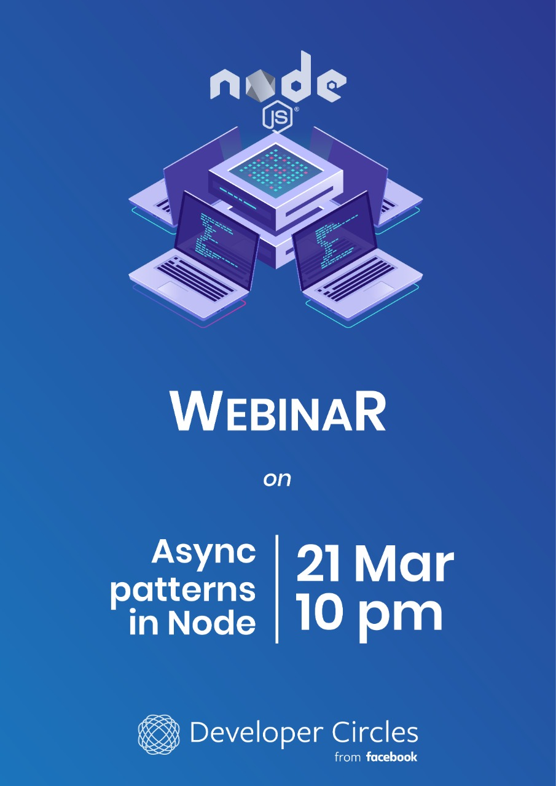

# Async patterns in node.js
A webinar by Facebook Developer Circle: Vellore

<br />

### Topics covered
<br />

- [X] Node environment setup
- [X] What is synchronous programming
- [X] What is asynchronous programming
- [X] Callbacks and promises
- [X] How to convert a function to a promise 
- [X] Callback hell
- [X] Recovery from callback hell


<br />


```
Click on the image to join our group
```

<br />

[](https://www.facebook.com/groups/DevCVellore/)
